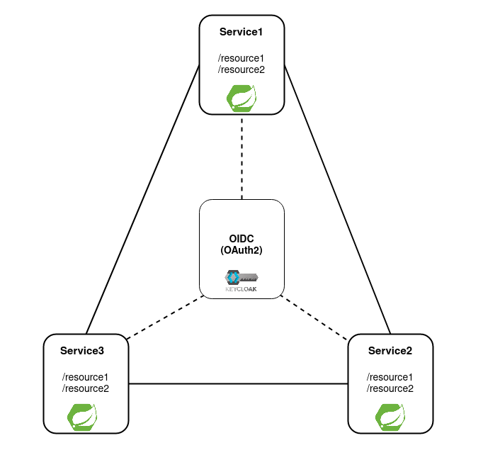
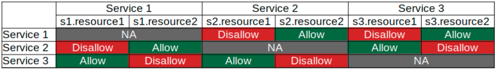
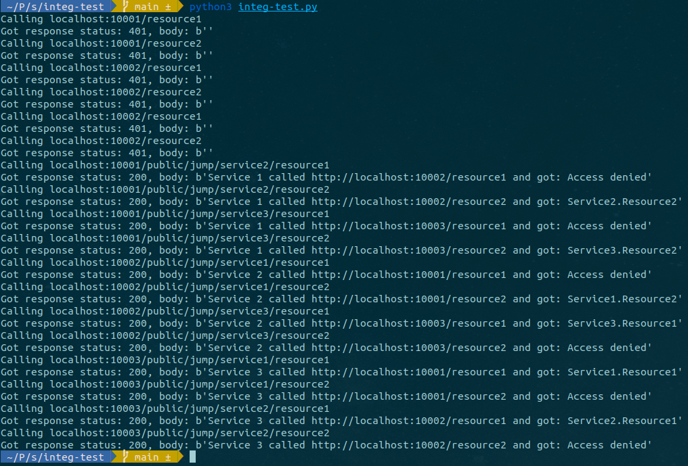

# Service-to-service Spring 5 and OAuth2 (OIDC) integration

## Architecture



## Demo access control model



## Running

Instruction.

## Testing

Assuming, all 3 services and OIDC provider running.


```
cd {PROJECT_ROOT_FOLDER}/integ-test
python3 integ-test.py
```

You should see something like this:


